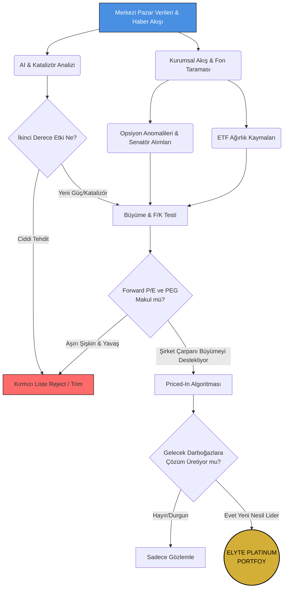

# 🏛️ Elyte Hedge Fund: Kurumsal Yatırım Manifestosu (Sürüm 1.0)

> *"Geçmişi fiyatlayanlar kaybeder; geleceğin darboğazlarını görebilenler dünyayı yönetir."*

Bu manifesto, **Elyte Hedge Fund**'ın agresif büyüme, yıkıcı teknoloji avcılığı ve veriye dayalı kurumsal analiz prensiplerini tanımlayan temel anayasasıdır. Geleneksel değer yatırımcılığını reddeder; teknolojik devrimlerin merkezinde durarak, kurumsal balinaların ve politikacıların ayak izlerini takip eden yeni nesil bir **"Quant-Fundamental Growth"** (Niceliksel ve Temel Büyüme) stratejisini benimser.

---

## 🧭 Temel Yatırım Felsefesi

Biz ucuz şirketleri değil, **büyüyen ve rekabet avantajını (MOAT) koruyan** şirketleri arıyoruz. Geleneksel Wall Street analistlerinin aşırı muhafazakâr veya geriden gelen tahminlerine değil; pazar vizyonerlerinin (CEO'ların) matematiksel gelir üretim potansiyellerine odaklanılır.

> [!IMPORTANT]
> **Kırmızı Çizgi:** Büyümesi durmuş, teknolojik dönüşümün gerisinde kalmış veya ileriye dönük F/K (Forward P/E), PEG ve EPS büyüme rasyoları sağlıksız seviyede şişmiş şirketlere (Örn: Araç, otonom ve robotikte geri kalan mevcut TSLA değerlemesi) fon ağırlığı tahsis **edilemez.**

---

## 🧬 Stratejik Sütunlar (The 6 Pillars)

### 1. Yapay Zekâ (AI) ve 2. Derece Etki Analizi
Yapay zekâyı sadece "çip üretenler" olarak görmüyoruz. Portföydeki her şirket için AI'ın bir tehdit mi yoksa katalizör mü olduğu sorgulanır.
*   **Negatif Etki (Tehdit):** Arama motoru tekelini kaybetme riskinden dolayı **Google**, AI rüzgarına rağmen ciddi bir tehdit altındadır. Benzer şekilde, Copilot/AI devriminin maliyet-gelir uçurumu yaratma ihtimali olan **Microsoft**, körü körüne en yüksek ağırlığı almamalıdır.
*   **Pozitif Etki (Katalizör):** AI'ı reklam hedefleme altyapısını güçlendirmek ve maliyetleri düşürmek için kaldıraç olarak kullanan **Meta**, 2. derece etkilerden asıl kazanan taraftır.

### 2. Geleceğin Darboğazlarını (Bottleneck) Avlama
Sermaye, darboğazları çözmek için su gibi akar. Bugünün GPU ve CPU krizi, yarının HBM hafıza birimleri, gelişmiş sıvı soğutma (Liquid Cooling), enerji şebekesi (Data Center Powering) ve Optik Bağlantılar darboğazına dönüşecektir.
*   Fon, *henüz tam başlamamış ancak matematiksel olarak yaşanması kesin olan* teknolojik darboğazları tespit edip sermayeyi erkenden o yöne kaydırır.

### 3. Savunma Altyapısı ve İnovatif Hedging
Güvenlik olmadan teknoloji var olamaz. ABD Savunma bütçesindeki agresif artışlar, fonun stabilite çapasını oluşturur.
*   Portföyde her zaman **PPA (Invesco Aerospace & Defense)** gibi ana savunma ETF'leri bulundurulur.
*   LMT, RTX, HII, GD ve NOC gibi ağır siklet ana yüklenicilerin yanı sıra; **Wall Street'in henüz keşfetmediği, değerlemesi makul, yüksek teknoloji üreten alt yüklenici küçük/orta ölçekli şirketler (Small-Cap Innovators)** bulunmak ve ağırlıklandırılmak zorundadır.

### 4. "Priced-In" (Fiyatlandı mı?) Relativite Analizi
Zirvede olan hisse pahalı demek değildir.
*   Eğer bir şirket (Örn: NVIDIA veya Hafıza/Memory üreticileri) sürekli zam yapıyor ve talebi karşılayamıyorsa; şirket fiyatı çok yükselmiş olsa dahi, gelir büyümesi (EPS Growth) fiyat artışından hızlıysa hisse **"Henüz Fiyatlanmamıştır"**.
*   Wall Street'in cılız analizleri yerine, GTC etkinliklerinde çizilen "1-3 Trilyon Dolarlık Fırsat Alanı" vizyonu Excel'de geleceğe yönelik İndirgenmiş Nakit Akışına (DCF) çevrilerek gerçeğe en yakın değerleme bulunur.

### 5. Kurumsal Para İzi (Follow the Money)
Fon yöneticileri duygusal karar vermez, fon akışlarını izler:
*   **ETF Ağırlık Değişimleri:** iShares U.S. Aerospace & Defense (ITA) gibi büyük ETF'lerin, portföyde %20'lere varan ağırlığa sahip bir devi (Örn: GE Aerospace) listeden uçurması veya azaltması kriz anı veya sermaye kayması demektir, ivedilikle alarm üretilir.
*   **13F Balina Takibi:** En tepedeki Hedge Fonların yüklü alım/satımları gölgelenerek (Shadowing) analiz edilir.
*   **Unusual Options (Opsiyon Anomalileri):** Haberi önceden alanların girdiği devasa hacimli Call/Put işlemleri, fiyat patlamalarının öncü göstergesidir.

### 6. Senatör ve Politikacı Takibi (Insider Edge)
Siyasiler, ihaleleri herkesten önce bilir.
*   ABD Kongre üyelerinin (özellikle Silahlı Hizmetler ve İstihbarat komitesindeki senatörlerin) savunma ve teknoloji alanındaki kişisel hisse ve opsiyon alımları anlık bir veri seti (Quiver Quantitative vb.) olarak sisteme akıtılmak ve alarm üretmek zorundadır.

---

## 📊 İşlem ve Filtreleme Hattı (Pipeline)

Sistemin karar alma mimarisi:

---

## 📡 Veri Besleme Kaynakları (Oracles)
Bu manifestonun teknik altyapısı, ilerleyen yazılım haritasında aşağıdaki kaynaklardan beslenecektir:
*   **Fundamentallar & Haberler:** Wall Street Journal, Seeking Alpha, Google Finance, Yahoo Finance
*   **Sektörel Öngörüler:** Kurumsal Raporlar, CEO Vizyon Metinleri, `@Beth_Kindig` ve teyitli X/Twitter Alpha hesapları
*   **Yasal Dinlemeler:** 13F Formları (Balinalar) ve Senatör Bildirim Ağları.

> [!TIP]
> Elyte Hedge Fund'ın ana görevi piyasayı "okumak" değil, piyasa daha okumaya başlamadan önce o cümleyi yazan olmaktır. **Kurallar katıdır, vizyon esnektir.**
